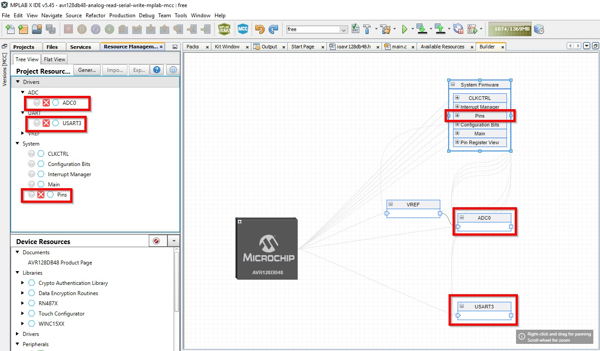
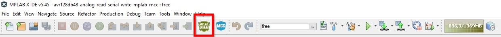

<!-- Please do not change this logo with link -->
[](https://www.microchip.com)

# Analog Read Serial Write - Potentiometer

This code example shows how to use the Analog to Digital Converter (ADC) to read an analog signal then sending the reading out using the Universal Synchronous and Asynchronous Receiver-Transmitter (USART). Going through this example you will be able to configure the AVR128DB48 device located on the Curiosity Nano development board, sample the signal from the potentiometer and display it on the Data Visualizer. 

  

Your final result should be looking something like this:


## Related Documentation

- [AVR® DB Family Product Page](https://www.microchip.com/en-us/products/microcontrollers-and-microprocessors/8-bit-mcus/avr-mcus/avr-db)
- [MPLAB® Code Configurator](https://www.microchip.com/en-us/development-tools-tools-and-software/embedded-software-center/mplab-code-configurator)
- [AVR128DB48 Curiosity Nano Hardware User Guide](https://www.microchip.com/DevelopmentTools/ProductDetails/PartNO/EV35L43A)
- [Curiosity Nano Base for Click Boards Hardware User Guide](https://www.microchip.com/developmenttools/ProductDetails/AC164162)

## Software Used

- [MPLAB® X IDE v5.45](http://www.microchip.com/mplab/mplab-x-ide) or newer 
- [MPLAB® Xpress IDE](https://www.microchip.com/xpress) (alternative to MPLAB X IDE)
- [MPLAB® XC8 v2.32](http://www.microchip.com/mplab/compilers) or a newer compiler 
- [MPLAB® Data Visualizer v1.1.799](https://www.microchip.com/en-us/development-tools-tools-and-software/embedded-software-center/mplab-data-visualizer) or newer
- [MPLAB® Code Configurator (MCC) v4.1.0](https://www.microchip.com/mplab/mplab-code-configurator) or newer 
- [MPLAB® Melody Library v1.37.26](https://www.microchip.com/mplab/mplab-code-configurator) or newer 
- [Microchip AVR128DB48 Device Support Pack AVR-Dx_DFP 1.2.98](https://packs.download.microchip.com/) or newer

## Hardware Used

- [Microchip AVR128DB48 Curiosity Nano Evaluation Kit](https://www.microchip.com/DevelopmentTools/ProductDetails/PartNO/EV35L43A)
- [MikroElektronika - POT 3 click](https://www.mikroe.com/pot-3-click)
- [Microchiop Curiosity Nano Base for Click boards](https://www.microchip.com/developmenttools/ProductDetails/AC164162)

## Setup

### Hardware User Guide

- Connect the **POT 3 click** to the mikroBUS Socket 1 on the **Curiosity Nano Base for Click Boards**
- Connect the **AVR128DB Curiosity Nano** to your **Curiosity Nano Base for Click Boards** using the strip headers in the box (you need to solder strip headers to Curiosity Nano Base)
- Connect the **AVR128DB Curiosity Nano** to your computer using a USB cable

In this project we will read the analog signal from the potentiometer (**POT 3 click**) and send it to the PC.

<p>
	  
</p>

When using the **Curiosity Nano Base for Click Boards** with the **POT 3 click** attached to mikroBUS Socket 1, the **VO** pin (Regulated Voltage Out) from **POT 3 click** will correspond to the AN1 pin of the **Curiosity Nano Base for Click Boards**. This in turn corresponds to **PD4** pin (PORTD pin 4) of the **AVR128DB Curiosity Nano**. 

<p>
	    
</p>

<p>
	   
</p>

These diagrams are available in the user guides / data sheets that can be found using the links provided under "Hardware Used".

To be able to configure the USART for writing to the PC, we would read the [AVR128DB Curiosity Nano Hardware User Guide](https://www.microchip.com/DevelopmentTools/ProductDetails/PartNO/EV35L43A) to know which USART to use. The hardware user guide shows that **USART3** is connected to the Virtual Serial Port (CDC) that acts as a general-purpose bridge between the host PC and the target device. This means that we will be selecting **USART3** for this example.

<p>
	  
</p>


### Software User Guide

- Download and install all software components as listed under 'Software Used' (note that MPLAB Xpress IDE is an online tool that cannot be downloaded)
- Download ZIP archive or clone GitHub repo for this project

The source code contains all the code that you need to run this project. Just download it and open the project in MPLAB X. No additional configuration is requried, apart from the setup of the Data Visualizer.

In the following, all steps required to generate this code is explained.

## Peripherals Configuration using MCC

Open MCC by clicking the button:


### Added Peripherals

Add the required peripherals:  Analog to Digital Converter (ADC0), Universal Synchronous and Asynchronous Receiver-Transmitter (USART3), and Pin Register. To do this, locate them in the **Device Resources** window, expand **Drivers** section and locate them. Then add them by clicking on the green '+' symbol in front of their names. This will add the peripherals to the **Project Resources** window. The System resources are automatically added to the **Project Resources** view.

The added peripherals will now also show up in the **Builder** view on the right.



### ADC Configuration

Click on the **ADC0** box to open the ADC0 configuration "Easy View".

To configure **ADC0**, change the highlighted sections accordingly:
- **Clock Pre-Scaler** = "CLK_PER divided by 2"
- **Sample Accumulation Number** = 4 results accumulated

Leave all other selections as they are.


When you accumulate samples, you will smooth the signal in case you have noise from the sensor/measurement. 
But we must then make sure to divide the measurement from the ADC with the number of accumulations done, or the reading will be x times larger than what is the correct number, where x is number of accumulations (we will fix this in the code later).

### System Configuration: PINS 

Configure **PINS** by expanding **System Firmware** box (click the '+' ) then click **Pins**. The **Pins Grid View** will show. Click on PORTD 4 on the ADC0.


### USART Configuration

Click on the **USART3** box to open the ADC0 configuration "Easy View". 

To configure **USART3**, change the highlighted sections accordingly:
- **Baud Rate** = 9600

Leave all other selections as they are.


### Generating project

1. Right click on **Generate** button, and choose **Force Update on All**.
1. Left Click **Generate** button.


The only additional code that is needed, apart from the code that MCC generates for you, is inside **main.c**. 

- Add constants for the data stream sent out from USART3:

```c
	#define START_TOKEN 0x03    /* Start Frame Token */
	#define END_TOKEN 0xFC      /* End Frame Token */
	#define ADC_ACCUMULATION 4 /* Number of accumulations chosen for ADC */
```

- Make a function that sends one byte of data out on USART3:

```c
void USART3_SendByte(const uint8_t data)
{
    while(!(USART3_IsTxReady()));		/* Wait until USART3 Data Register Empty */
    USART3_Write(data);						/* Send byte */
}
```

- Make a function that transmits the data stream on USART3 (start token, 16 bit measurement, end token):

```c
void USART3_send16bitDataStream( const uint16_t data)
{
	USART3_SendByte(START_TOKEN);			/* Send start token */
	USART3_SendByte(data & 0x00FF);			/* Send first 8 bits of measurement (low byte) */
	USART3_SendByte(data >> 8);					/* Send last 8 bits of measurement (high byte) */
	USART3_SendByte(END_TOKEN);				/* Send stop token */
}
```

- In the main() function, take a reading from the ADC0 (that is sampled X times), then divide this by X (here: X = 4) to get correct (mean) value, then send this out on USART3:

```c
int main(void)
{
    SYSTEM_Initialize();
        
    while(1)
    {
		/* When variable is used, it will update value with latest ADC0 result */
		uint16_t measurement = ADC0_GetConversion(ADC_MUXPOS_AIN4_gc);	

		measurement /= ADC_ACCUMULATION;			/* Divide readout by number of accumulated result chosen */
		USART3_send16bitDataStream(measurement);	/* Send data stream out on USART3 */
    }
}
```

## Operation

### Open the Project in MPLAB X

1. Download the zip file or clone the example to get the source code
1. Open the .X file with the MPLAB® X IDE
1. Set the project as Main project by right clicking the project name in the *Projects* window (Ctrl+1) and select *"Set as Main Project"* from the drop-down menu
1. Program the project to the AVR128DB48 Curiosity Nano: 
	- First clean and build the project by pressing the *Clean and Build Main Project* button
	
	
	
	- Then make and program the project to the AVR128DB48 by clicking the *Make and Program Device Main Project* button
	
	

### Setting Up Data Visualizer

After programming the device, we would like to use the **Data Visualizer** to see the output. Click the **Data Visualizer** button:



We want to connect to the "Serial/CDC Connection" (that is why we are using USART3 in our setup) to view the measurements. The name ("COMx") will differ, our example shows "COM11" but this depends on your PC and which enumeration you get on the USB port.

Configure the CDC Connection with **9600** baud rate (same as for USART3) and connect to it by pressing the "play" symbol (pointed to by red arrow). There should be a pop-up window stating "COMx Streaming Started".


The USART will sends one byte (8 bits) at a time, so in order for you to view the 16-bit measurement value you need to create a variable that you plot on the screen of the Data Visualizer. 
First off, remember the data frame that we send from **USART3**: <END_TOKEN> +  <Measurement High Byte> + <Measurement Low Byte> + <START_TOKEN> 
(actually, we are sending it in the inverse order, but this order shown here is the order that the Data Visualizer will present the data, the data to the far right is what is received first).
The data you want to plot are the measurement value, defined in your code as

```c
uint16_t measurement = ADC0_GetConversion(ADC_MUXPOS_AIN4_gc);
```

and sent out from **USART3** as two bytes of data, low byte sent first.

Click the *New Variable Streamer* '+' button.


1. Give the Variable Streamer a suitable name (in this example we use "*Potentiometer*").
1. Framing mode = Ones' Complement
1. Start of Frame = 03 (remember that *START_TOKEN* = 0x03).
The End of Frame value automatically adjusts based on you start value.
1. Click the '+' symbol to add a Variable
1. Give the Variable a name (in this example we use *Measurement*).
1. Define the type as *Uint16* (same as the measurement variable declared in your code).
Notice the Frame Size now automatically updates to 4 bytes.
1. Click the *Save* button.


  
To be able to plot this variable, set the *CDC Connection* ("COMx on AVR128DB46 Curiosity Nano") you started streaming in the first step of Data Visualizer setup as *Source*.


To be able to graph the measurement, select *Plot variable* from the pull-down menu found under the variable name you created (here: *measurement*).


When you have done this, you would expect to get a similar output as the graph at the top of the page. But probably you need to adjust the scales for the plot, since this is not always correct by default.


1. Pause the plot by clicking the indicated *Pause* button (as indicated top right).
1. Now you are able to manually enter time scale. Enter '0' in the left box, and '1s' in the right.
1. Change y-axis scale by pressing the *Scale* button (as indicated next to top right).
1. Change the scale, enter '0' to the left and '20k' to the right.

When you are done, it should look like the screenshot shown below.


### Plotting your results

Now, press the *Pause* button again (that now looks like a *Fast Forward* button, on the *Time Axis* section), and you should see the same result as the animated GIF on top of this text. Try adjusting the potmeter up and down, and see that the plot changes accordingly.

The result you see is the measurement from the potentiometer on the Click board, sampled using the ADC then sent out over the USART associated with the virtual COM port (USART3) and presented in the Data Visualizer of MPLAB X.


## Summary

The example has shown how MCC can be used to easily configure the ADC to sample an analog signal from a pin and send it over USART to the Data Visualizer.
